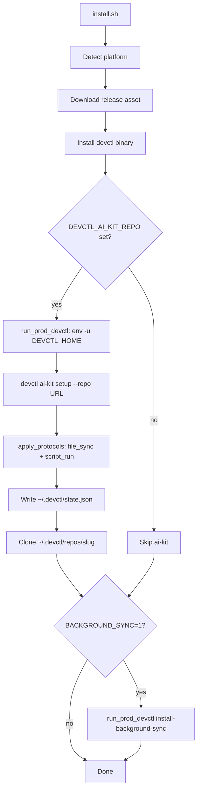
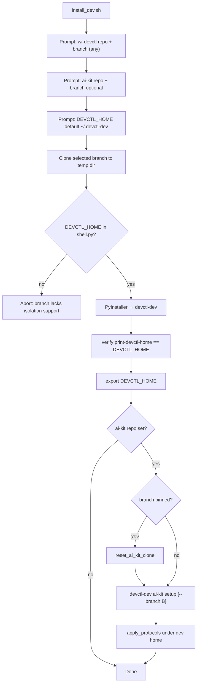
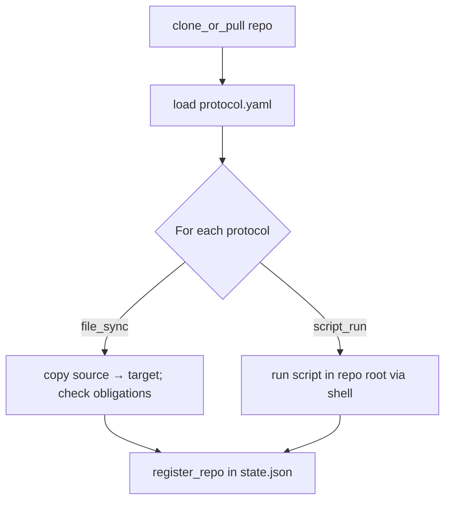
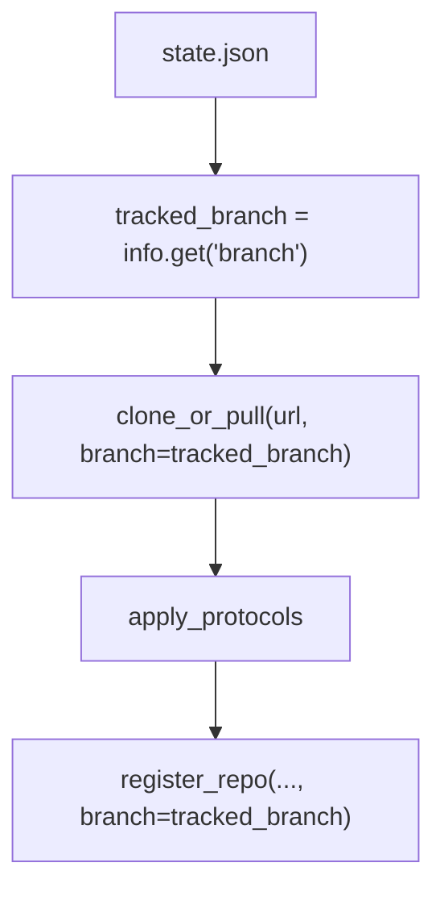

# Plan: dev/prod isolation, ai-kit branch tracking, and `script_run`

Implementation plan and reference for wi-devctl changes compared to `main`. Applies to **any feature branch** that includes this work—not tied to a specific branch name.

**Goal:** Let engineers build and test wi-devctl + ai-kit from an arbitrary git branch without touching production `devctl`, `~/.devctl`, or prod background sync.

---

## 1. Problem we solved

| Before (`main`) | After (this work) |
|-----------------|-------------------|
| One home (`~/.devctl`) for everything | Prod `~/.devctl` · dev `~/.devctl-dev` |
| One binary (`devctl`) | Prod `devctl` · dev `devctl-dev` |
| Dev testing could pollute prod state | Isolation enforced in code + installers |
| ai-kit tracked whatever branch was checked out | Optional `--branch`; branch stored in `state.json` |
| Protocol engine: `file_sync` only | `file_sync` + **`script_run`** |
| Prod `install.sh` after dev could fail | Prod unsets `DEVCTL_HOME`; dev verifies home before ai-kit |

**Typical failure mode:** Dev wrote an ai-kit clone (e.g. on a feature branch) into `~/.devctl`. Later, prod `install.sh` reused that clone (same URL → same slug), ran `git pull` on the **existing checkout** without switching branch, and protocol apply failed—even though the user passed their prod repo URL.

---

## 2. Constraints (design rules)

1. **Prod must never read dev home** — even if the shell exports `DEVCTL_HOME=~/.devctl-dev`.
2. **Dev must never write prod home** — binary must honor `DEVCTL_HOME`; `install_dev.sh` verifies before ai-kit.
3. **Same ai-kit URL allowed in both envs** — isolation is by home directory, not by blocking duplicate URLs.
4. **Prod binary from releases only** — `install.sh` downloads a tagged GitHub release asset; no git branch build for wi-devctl.
5. **Dev binary from any chosen GitHub branch** — `install_dev.sh` remote-clones + PyInstaller; selected branch must contain `DEVCTL_HOME` support in `shell.py`.
6. **Dev install is for testing** — `install_dev.sh` skips background sync (manual opt-in only).
7. **Branch pin is optional** — without `--branch`, `clone_or_pull` keeps current checkout and only `git pull`s.
8. **Background jobs don't inherit shell env** — launchd/cron get explicit `DEVCTL_HOME` when home ≠ `~/.devctl`.
9. **Minimal prod installer diff** — `install.sh` adds `run_prod_devctl()` only; release path unchanged.
10. **Protocol types are explicit** — `file_sync` needs `source`+`target`; `script_run` needs `script`; validation is per-type.

---

## 3. Architecture: two parallel stacks

```
┌─────────────────────────────────────────────────────────────────┐
│                        PRODUCTION                                │
├─────────────────────────────────────────────────────────────────┤
│ install.sh → GitHub release → devctl                             │
│ Home: ~/.devctl (DEVCTL_HOME unset during ai-kit steps)          │
│ State: ~/.devctl/state.json                                      │
│ Repos: ~/.devctl/repos/<slug>/                                   │
│ Sync:  com.devctl.config-sync (optional)                         │
└─────────────────────────────────────────────────────────────────┘

┌─────────────────────────────────────────────────────────────────┐
│                        DEVELOPMENT                               │
├─────────────────────────────────────────────────────────────────┤
│ install_dev.sh → clone <any branch> → PyInstaller → devctl-dev   │
│ Home: ~/.devctl-dev (export DEVCTL_HOME)                         │
│ State: ~/.devctl-dev/state.json                                  │
│ Repos: ~/.devctl-dev/repos/<slug>/                               │
│ Sync:  not installed by install_dev.sh                           │
└─────────────────────────────────────────────────────────────────┘
```

**Why stored differently:** Same data *shape* (state, repos, logs, backups), different *roots*. Repo slug keys (`org-kit`) are the same; filesystem paths differ so dev experiments cannot overwrite prod config.

---

## 4. Flows

### 4.1 Production install (`install.sh`)



### 4.2 Dev install (`install_dev.sh`) — any wi-devctl branch



### 4.3 Protocol apply (setup / update / sync)



### 4.4 ai-kit update / background sync



### 4.5 `clone_or_pull` decision tree

| Clone exists? | `branch` arg | Action |
|---------------|--------------|--------|
| yes | set | fetch → checkout branch → pull --ff-only |
| yes | none | git pull (current branch unchanged) |
| no | set | clone --branch B; on failure → clone + checkout B |
| no | none | plain clone (remote default branch) |

---

## 5. Complete change list (vs `main`)

### 5.1 Installers & docs

| File | Change |
|------|--------|
| `install.sh` | `run_prod_devctl()` — `env -u DEVCTL_HOME` for ai-kit setup + background sync |
| `install_dev.sh` | **New** — interactive dev installer; builds `devctl-dev` from any GitHub branch; verifies isolation; ai-kit retry/warmup; **no** background sync |
| `README.md` | Dev install section, `DEVCTL_HOME`, `--branch`, `script_run` docs, env var table |

### 5.2 Dev/prod isolation

| File | Change |
|------|--------|
| `src/devctl/utils/shell.py` | `get_devctl_home()` respects `DEVCTL_HOME`; all paths (state, repos, logs, backups) derive from it |
| `src/devctl/cli/main.py` | Hidden `print-devctl-home` — used by `install_dev.sh` to verify built binary |
| `install.sh` | Prod commands never inherit dev `DEVCTL_HOME` |
| `install_dev.sh` | `run_devctl()` always passes `DEVCTL_HOME`; post-build isolation check |

### 5.3 ai-kit branch tracking

| File | Change |
|------|--------|
| `src/devctl/core/repo_manager.py` | `clone_or_pull(url, branch=None)`; `_checkout_and_pull()`; `resolve_default_branch()`; shallow→full clone fallback |
| `src/devctl/core/versioning.py` | `register_repo(..., branch=None)` — optional `branch` in `state.json`; preserves existing branch when arg is `None` |
| `src/devctl/cli/ai_kit.py` | `setup --branch`; update/sync use `info["branch"]`; `_repo_label()` for logs (`slug@branch`); status shows branch |
| `src/devctl/core/config_sync.py` | Hourly sync pulls using tracked branch from state |
| `install_dev.sh` | `reset_ai_kit_clone()` when ai-kit branch changes — deletes clone + clears branch pin in dev state |

### 5.4 Background sync isolation

| File | Change |
|------|--------|
| `src/devctl/core/background_sync.py` | Dynamic `_launchd_label()` from home (e.g. `com.devctl-dev.config-sync`); `_devctl_home_env()` injects `DEVCTL_HOME` in plist/cron when non-default; `_get_devctl_path()` finds `devctl` or `devctl-dev`; cron dedup by full binary marker |

### 5.5 Protocol engine — `script_run` (new)

| File | Change |
|------|--------|
| `src/devctl/core/protocol_engine.py` | New protocol type **`script_run`**; per-type validation; `_script_run()` executor |

**Before (`main`):** Only `file_sync`. Every protocol required `name`, `type`, `source`, `target`.

**After:** Two protocol types with different required fields:

| Type | Required fields | Behavior |
|------|-----------------|----------|
| `file_sync` | `source`, `target` | Copy/merge repo path → local target; check obligations/recommendations under target |
| `script_run` | `script` | Run shell command **from cloned repo root** (`cwd=repo_path`); capture stdout/stderr; fail on non-zero exit |

**Example in `protocol.yaml`:**

```yaml
protocols:
  - name: cursor-rules
    type: file_sync
    source: cursor
    target: ~/.cursor
    obligations: [rules/security.json]

  - name: python-deps
    type: script_run
    script: |
      set -euo pipefail
      VENV_DIR="$HOME/.wi_venv"
      python3 -m venv "$VENV_DIR" 2>/dev/null || true
      "$VENV_DIR/bin/pip" install -r requirements.txt
```

**Flow for `script_run`:**

1. ai-kit clones/pulls the config repo
2. `load_protocols()` parses YAML — validates `script` is present for `script_run`
3. `execute_protocol()` calls `_script_run(script, repo_path, name)`
4. Script runs with `subprocess.run(..., cwd=repo_path, shell=True)`
5. Non-zero exit → `RuntimeError` with command, stdout, stderr
6. On success, returns empty obligation/recommendation lists (script_run does not file-check target paths)

**Other protocol_engine tweaks:**

- `Protocol` dataclass: optional `source`, `target`, `script` defaults; `obligations`/`recommendations` use `default_factory=list`
- Validation split by type instead of requiring source+target for all protocols
- Verbose logging differs for `script_run` vs `file_sync`

### 5.6 Tests

| File | Covers |
|------|--------|
| `tests/test_shell.py` | `DEVCTL_HOME` override; state/repos paths |
| `tests/test_background_sync_dev.py` | Dev LaunchAgent label + plist `DEVCTL_HOME` |
| `tests/test_background_sync.py` | Prod launchd install |
| `tests/test_cli.py` | `print-devctl-home`, `--branch` setup, branch in sync logs |
| `tests/test_repo_manager.py` | Branch clone, checkout, pull, fallbacks |
| `tests/test_versioning.py` | Branch field in `register_repo` |
| `tests/test_config_sync.py` | Sync uses tracked branch |
| `tests/test_protocol_engine.py` | **`script_run`** load, execute, failure, validation |

### 5.7 Other

| File | Change |
|------|--------|
| `examples/protocol.yaml` | Example trimmed/updated (see repo for current example) |

**Scope vs `main`:** 19 files changed, ~1144 insertions, ~106 deletions.

---

## 6. Fallbacks

| Area | Primary | Fallback |
|------|---------|----------|
| Install dir | `/opt/homebrew/bin` | `/usr/local/bin` → `~/.local/bin` + shell rc |
| Dev wi-devctl clone | shallow `--depth 1 --branch` | full clone + checkout |
| ai-kit clone with branch | `clone --branch B` | clone + `checkout B` |
| ai-kit existing clone, no branch | — | `git pull` only (no branch switch) |
| Dev ai-kit branch change | — | `reset_ai_kit_clone` wipes dir + branch in state |
| Dev ai-kit setup | 1 attempt | warmup `--help` + 3 retries |
| Background binary path | frozen executable | argv0 → `which devctl` → `which devctl-dev` |
| Prod ai-kit during install | inherit shell env | `env -u DEVCTL_HOME` |
| Dev commands during install | inherit shell env | `env DEVCTL_HOME=…` |
| launchd/cron env | default `~/.devctl` | inject `DEVCTL_HOME` when home differs |
| `register_repo` branch | explicit `--branch` | preserve existing branch if arg is `None` |
| `script_run` failure | — | raises with exit code + stdout/stderr (no silent skip) |

---

## 7. Key env vars

| Variable | Production | Development |
|----------|------------|-------------|
| `DEVCTL_HOME` | unset during prod install steps | `~/.devctl-dev` (exported) |
| `DEVCTL_AI_KIT_REPO` | optional in `install.sh` | prompted in `install_dev.sh` |
| `DEVCTL_AI_KIT_REPO_BRANCH` | not passed by `install.sh` | optional prompt |
| `DEVCTL_AI_KIT_BACKGROUND_SYNC` | `1` enables in `install.sh` | skipped in `install_dev.sh` |
| `GITHUB_TOKEN` | release download + private clone | wi-devctl / ai-kit clone |

**Two different “branch” concepts:**

| Branch type | Used for | Set by |
|-------------|----------|--------|
| wi-devctl build branch | Which code builds `devctl-dev` | `install_dev.sh` prompt (`DEVCTL_BRANCH`) |
| ai-kit repo branch | Which config repo branch to sync | `ai-kit setup --branch` or `install_dev.sh` prompt |

---

## 8. Operational checklist

**Test any wi-devctl branch:**
```bash
bash install_dev.sh
# enter owner/repo + branch name when prompted
devctl-dev ai-kit status
```

**Prod install (safe after dev work):**
```bash
export DEVCTL_AI_KIT_REPO=...
bash install.sh
```

**Pin ai-kit to a feature branch:**
```bash
devctl ai-kit setup --repo <url> --branch <any-branch>
devctl ai-kit update   # uses branch from state.json
```

**If prod home was polluted (pre-isolation dev runs):**
```bash
cat ~/.devctl/state.json
rm -rf ~/.devctl/repos/<slug>
devctl ai-kit setup --repo <url> --branch main
```

**Manual dev background sync (optional):**
```bash
DEVCTL_HOME=~/.devctl-dev devctl-dev ai-kit install-background-sync
```

---
